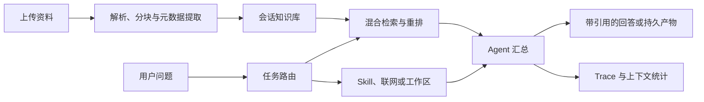

# Agentic RAG Chatbot

把散落在 PDF、Word、表格和文本文件里的资料，变成可检索、可引用、可继续处理的知识工作台。

Agentic RAG Chatbot 是一个面向个人与小团队的本地知识工作产品。它以会话为单位管理资料，回答时给出原文引用和执行轨迹，也能调用 Skill、联网搜索、Python 工具或隔离工作区完成后续任务。前端采用 React，后端采用 FastAPI，数据、索引和会话记录默认保存在本地。

## 为什么做这个产品

阅读报告、论文、业务材料或数据表时，真正耗时的往往不是得到一段摘要，而是在多个文件中定位事实、核对出处，再把结论整理成可以交付的内容。

常见做法是逐份翻阅、使用关键词搜索，或者把片段复制到通用聊天工具中。这些方式有几个明显问题：文件之间彼此割裂，长文档容易漏掉上下文，回答难以追溯原文，分析完成后还要切换到其他工具制作结果。

这个项目希望把这些步骤接起来。用户上传资料后，可以在同一会话中提问、核对证据、运行分析流程，并把结果保存为产物。系统负责判断任务需要本地文档、外部信息还是工作区工具，同时保留每次检索和调用的记录。

## 适合谁使用

- 需要阅读论文、课件和研究资料的学生或研究者
- 经常处理产品文档、调研报告和项目材料的产品、运营与咨询人员
- 希望在本地管理内部资料，并要求回答可以回到原文核验的小团队
- 正在学习 RAG、Agent、工具调用或检索评测，希望获得完整工程参考的开发者

## 典型使用场景

- 上传多份报告，追问其中的结论、金额、日期、作者和页码
- 对 PDF 或 Word 文档做摘要、结构化审阅和风险梳理
- 分析 CSV 或 Excel，查看字段类型、缺失值和数值统计
- 同时参考上传资料与联网信息，生成带证据的综合回答
- 在隔离工作区中运行命令、处理文件，并把结果保存回会话
- 查看一次回答经过了哪些路由、检索和工具调用，定位效果问题

## 核心能力

### 文档理解

支持 PDF、Word、Markdown、纯文本、CSV 和 Excel。入库流程会保存原始文件，完成解析、切分和向量化，并提取标题、作者、章节、物理页码、印刷页码、表格以及金额、日期等结构化事实。大文件可以转入后台任务，前端会显示处理状态。

### 有证据的混合检索

检索层组合向量搜索、BM25 和 RRF，并按查询情况使用 CrossEncoder 重排与 HyDE 查询扩展。回答中的引用可以打开查看来源、页码、Chunk ID、相关分数和原文，便于检查模型是否真的依据资料作答。

### 任务路由与 Skill

系统会区分普通对话、文档问答、结构化事实查询、表格分析和联网搜索，只向 Agent 开放当前任务需要的工具。内置 Skill 覆盖中文摘要、文档深度分析和表格分析，也可以通过后端接口创建和管理新的 Skill。复杂请求可以拆给文档、联网和工作区 Worker 并行取证，再由主 Agent 汇总。

### 长对话管理

前端展示当前模型的上下文用量。当会话接近窗口上限时，后端会压缩较早的完整对话轮次，保留任务目标、已确认约束、文件引用和未解决问题，减少长对话突然失效的情况。

### 隔离工作区与产物

工作区模式基于 OpenSandbox。每个会话使用独立的 `/workspace`，可以导入上传文件、执行命令、读写文件和管理进程。写入输出目录的结果会登记为持久产物，Sandbox 回收后仍可下载或恢复。工作区默认关闭网络访问，并设置 CPU、内存、命令长度、运行时间和输出大小限制。

### 可观察的执行过程

系统记录路由结果、Skill 选择、检索候选、重排结果、工具输入输出预览、耗时、引用和错误。前端 Trace 面板可以直接查看这些信息，便于调试回答质量，而不必只根据最终文本猜测 Agent 做了什么。

## 和常见方案的区别

| 处理环节 | 常见方式 | 本项目 |
| --- | --- | --- |
| 找资料 | 手动翻页或关键词搜索 | 混合检索、重排和结构化事实查询 |
| 核对答案 | 重新打开文件定位原文 | 回答附带可点击引用、页码和原文片段 |
| 处理复杂任务 | 在多个工具间复制内容 | 路由到文档、联网、Skill 或隔离工作区 |
| 长对话 | 超出窗口后丢失早期信息 | 估算上下文用量并压缩早期完整轮次 |
| 分析结果 | 手动另存和整理 | 生成并登记可下载、可恢复的会话产物 |
| 排查问题 | 只能观察最终回答 | 保存路由、检索、工具调用和耗时轨迹 |

## 一次任务如何完成

1. 用户创建会话并上传资料。
2. 后端校验文件，解析正文、页面与章节结构，生成检索分块和结构化元数据。
3. 用户输入问题，路由器判断是否需要文档、联网、Skill、代码或工作区能力。
4. 检索器召回并重排证据，Agent 在限定工具范围内生成回答或执行任务。
5. 前端流式展示回答、上下文用量和处理状态；引用与 Trace 可随时展开核验。
6. 如果任务生成文件，系统将其登记为会话产物，供后续下载和恢复。



## 技术架构

- 前端：React、TypeScript、Vite、Ant Design
- 后端：Python、FastAPI、LangChain
- 检索：Hugging Face Embeddings、ChromaDB、BM25、RRF、CrossEncoder
- 数据：SQLite、pandas、PyArrow、DuckDB、PyPDF、python-docx、openpyxl
- 工作区：OpenSandbox，可选启用

## 本地部署

### 环境要求

- Python 3.10 或更高版本
- Node.js 18 或更高版本
- npm
- 可用的大模型 API 密钥

首次安装 `sentence-transformers` 等依赖时可能需要下载模型。

### 1. 获取代码并创建 Python 环境

```powershell
git clone https://github.com/liyf4/chatbot2.git
cd chatbot2
python -m venv .venv
.\.venv\Scripts\Activate.ps1
pip install -r requirements.txt
```

Linux 或 macOS 使用以下命令激活虚拟环境：

```bash
source .venv/bin/activate
```

### 2. 配置环境变量

复制 `.env.example` 为 `.env`，至少填写模型服务密钥。联网搜索与隔离工作区的配置按需填写。

```dotenv
ZAI_API_KEY=your_api_key
GOOGLE_API_KEY=
GOOGLE_CSE_ID=
SERPAPI_API_KEY=
PROXY_PORT=
OPEN_SANDBOX_API_KEY=
```

### 3. 安装前端依赖

```powershell
cd frontend
npm install
cd ..
```

### 4. 启动项目

Windows 可以运行：

```powershell
.\start.cmd
```

也可以在各平台使用 Python 启动器：

```powershell
python scripts/dev.py
```

默认地址：

- 前端：http://127.0.0.1:5173
- 后端健康检查：http://127.0.0.1:8000/api/health
- FastAPI 接口文档：http://127.0.0.1:8000/docs

如需分别启动：

```powershell
uvicorn backend.main:app --host 127.0.0.1 --port 8000 --reload
```

```powershell
cd frontend
npm run dev
```

## 配置说明

通用的非敏感配置位于 `config.yaml`，包括模型、检索、元数据、上下文、数据限制和 Sandbox 设置。敏感值只应通过 `.env` 注入。

示例配置已启用 Sandbox。使用前需要准备 OpenSandbox 服务和 `chatbot-workspace:py311-pandas-duckdb` 镜像；如果只使用普通对话，把 `sandbox.enabled` 改为 `false`。认证密钥放在 `.env` 的 `OPEN_SANDBOX_API_KEY` 中。

## 项目结构

```text
backend/           FastAPI 接口与流式聊天服务
core/              Agent、检索、路由、上下文与文档处理
db/                会话、文件、Skill 和工作区状态管理
frontend/          React + TypeScript 前端
prompts/           Prompt 构建与模板
sandbox_runtime/   隔离工作区运行时适配
skills/            可执行 Skill 定义
tools/             文档、联网、代码和工作区工具
tests/             单元、集成、性能与 RAG 评测
config.yaml        非敏感运行配置
```


## 前端构建

```powershell
cd frontend
npm run build
```

## Agent 与 RAG 测试

测试不依赖前端点击，全部直接验证 Python 组件或 FastAPI 接口。测试运行时使用临时 SQLite、聊天历史、上传目录和 Chroma 索引，不会写入现有用户数据。

离线单元与后端 API 测试：

```powershell
python -m unittest discover -s tests -v
```

使用 `config.yaml` 中的真实 Embedding 与 CrossEncoder 运行本地 RAG 评测：

```powershell
python scripts/run_agent_evaluation.py --mode local --output-dir test-results/agent-rag/latest
```

使用 `.env` 中的 `ZAI_API_KEY` 运行真实模型后端 E2E：

```powershell
python scripts/run_agent_evaluation.py --mode llm --require-llm --output-dir test-results/agent-rag/latest
```

运行 Agent/RAG 性能与压力画像（索引规模、冷/热缓存、并发检索、持续负载、真实 CrossEncoder 突发、路由吞吐和资源边界）：

```powershell
python scripts/run_agent_evaluation.py --mode performance --scales 100 500 1000 2500 5000 --concurrency 1 4 8 16 --queries-per-level 24 --soak-queries 300 --rerank-queries 4 --output-dir test-results/agent-rag/latest
```

性能模式记录每个规模的索引吞吐、冷/热加载耗时，以及检索的 QPS、P50/P95/P99、错误率和最少返回数。延迟不使用与硬件绑定的固定门槛；零错误、非空结果、缓存命中、真实重排未跳过、路由一致性，以及上传大小与单文件 Chunk 上限的正确拒绝属于必过项。

使用可人工检查的 50 题纯 Markdown 长文档基准，逐题评估 CrossEncoder Accuracy@1、RRF Accuracy@4、真实模型回答准确度、元数据完整性和引用证据一致性：

```powershell
python scripts/run_rag_case_evaluation.py --require-llm --output-dir test-results/agent-rag/case-study
```

固定长文档、问题、标准答案及证据 ID 位于 `tests/fixtures/agent_rag_case_study/`；逐题模型答案和检索排名对照输出到 `test-results/agent-rag/case-study/comparison.md`。

本地 RAG 的最低标准为 Recall@4 不低于 `0.85`、MRR@4 不低于 `0.75`、跨会话泄漏和路由越权均为 `0`。复杂查询必须实际执行 CrossEncoder，不能以回退结果冒充重排通过。真实模型模式验证回答事实、结构化引用、证据不足拒答、提示注入防护、HyDE 和 SSE 流式接口。

报告生成在 `test-results/agent-rag/latest/report.json` 与 `report.md`。这些是每次运行的机器本地结果，不纳入版本控制。当前范围明确排除联网搜索、浏览器/前端、Workspace 和 OpenSandbox。
